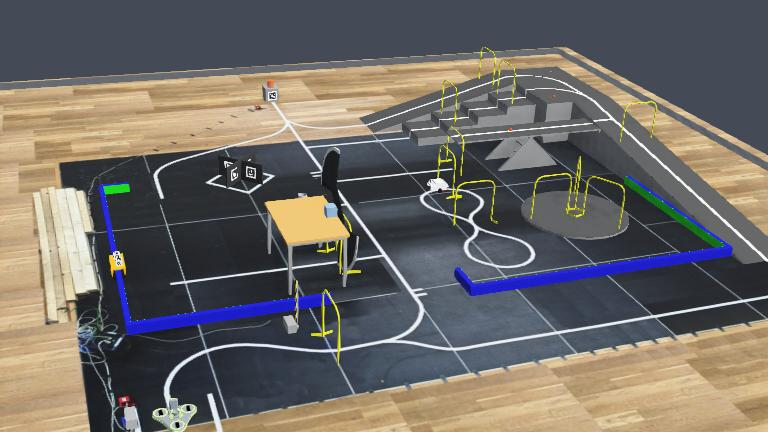

# DTU RoboCup 2025 – Webots Simulation

This repository contains a Webots model of the **DTU RoboCup 2025** track.

## Running the Simulation

1. Open the `worlds/Robocup2025.wbt` file in Webots.  
2. In Webots, open the controllers located in the `controllers` directory and compile each of them.  
3. You can now run the simulation and control the robot using your keyboard.  
   Check the console window for the list of available control keys.

## Track and Obstacles

The physical dimensions of the obstacles are **approximately accurate**, though they were not measured directly.  
Some measurements were estimated from competition videos and from tests with my own robot on the physical track.

The floor texture was created from a **top-view image** of the track, with perspective correction applied.  
(See this video for the process: [https://www.youtube.com/watch?v=iedDTQ3Ynw4](https://www.youtube.com/watch?v=iedDTQ3Ynw4))  
As a result, the simulated dimensions are accurate within approximately **±50–100 mm**.

All obstacles are implemented as **PROTO files**, making it easy to modify or create new track versions.  
Obstacles that have appeared in multiple competitions are prefixed with `common`, while those unique to 2025 are prefixed with `2025`.

## Ball Container Simulation

The obstacles containing balls are **not physically simulated**, since including them would significantly slow down the simulation.  
In most use cases, only the ball positions and camera appearance are important.

Therefore, the **ball container** is implemented as a **supervisor node**, which moves the balls directly to their final positions when the robot pushes the container.  
This setup makes it easy to test different ball arrangements systematically.  
Currently, the controller for `obstacle2025BallContainer` places the balls **randomly within a square area**.
